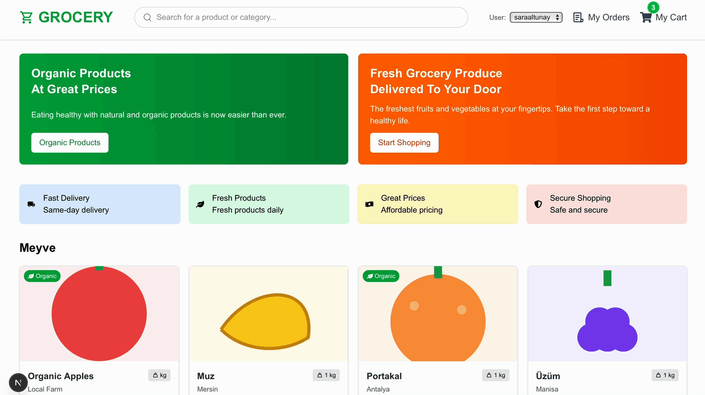

# Grocery E-commerce (Next.js + Stripe + MongoDB)

A modern grocery e-commerce app built with Next.js 15, React 19, and TypeScript. Browse products, search, manage a cart, and complete purchases with Stripe Checkout. Orders are persisted to MongoDB. The UI is responsive and includes a user switcher for demo/testing.

## Features

- Product listing and details (with organic badge and nutrition info)
- Full-text search (name/description), category and organic filtering
- Shopping cart with quantity controls and clear cart
- Stripe Checkout (success and cancel flows)
- Orders history per user
- Server/actions backed by MongoDB (Mongoose models)
- Responsive design, icons, and toasts
- Demo user switcher in the header to switch between users

## Tech Stack

- Next.js 15 (App Router, Route Handlers)
- React 19 + TypeScript 5
- MongoDB + Mongoose
- Stripe (Checkout Sessions)
- Tailwind CSS 4
- React Icons
- React Toastify

## Getting Started

1) Install dependencies
```bash
npm install
```

2) Configure environment variables
Create a `.env.local` in the project root:
```
MONGO_URI=your-mongodb-uri
STRIPE_SECRET_KEY=sk_test_...
STRIPE_WEBHOOK_SECRET=whsec_...          # optional, for webhook testing
NEXT_PUBLIC_API_URL=http://localhost:3000
NEXT_PUBLIC_USER_ID=guest                 # default fallback user
```

3) Run the dev server
```bash
npm run dev
# open http://localhost:3000 (or the port you configured)
```

4) Seed data (optional, if present)
- Check routes under `src/app/api/(endpoints)/seed*`

## How It Works

- Data
  - Models in `src/app/api/models/` (Cart, Grocery, Order)
  - Mongo connection at `src/app/api/utils/connectMongo.ts`

- APIs
  - Groceries: `GET /api/groceries` (supports `?query=`, `?category=`, `?organic=true`)
  - Cart:
    - `GET /api/cart?userId=...`
    - `POST /api/cart` add/update item
    - `PUT /api/cart/item` update quantity
    - `DELETE /api/cart/item?userId=...&groceryId=...` remove item
    - `DELETE /api/cart?userId=...` clear cart
  - Checkout: `POST /api/checkout` creates Stripe Checkout session for single item or entire cart
  - Orders:
    - `GET /api/orders?customer_id=...`
    - Admin utilities in `src/app/api/(endpoints)/orders/*`

- UI
  - Header search submits to `/?query=...`
  - Home page reads `searchParams` and passes filters to Products
  - Product details include “Add to Cart” and “Buy Now”
  - Success: `/success`
  - Cancel: `/cancel`
  - Orders: `/orders` (per active user)

## User Switching (Demo)

- Use the “User” select in the header to switch users.
- It sets `userId` in cookie/localStorage and refreshes server components.
- Orders and cart are scoped by the active user.

## Webhook (Optional)

To test Stripe webhooks locally:
```bash
stripe listen --forward-to localhost:3000/api/webhook
```
- Paste the printed `whsec_...` into `.env.local` as `STRIPE_WEBHOOK_SECRET`.

## Scripts

- Dev: `npm run dev`
- Build: `npm run build`
- Start: `npm run start`
- Lint: `npm run lint`

## Folder Structure

- `src/app/` — pages, layouts, and API route handlers
- `src/components/` — UI components (header, cart, product, home)
- `src/service/` — client/server fetch services
- `src/types/` — TypeScript types
- `public/` — static assets

## Notes

- Currency displayed as TRY across the UI.
- If you change the dev port, also update `NEXT_PUBLIC_API_URL`.

## License

MIT (or your preferred license)
# 3-grocery-ecommerce
Website With HTML CSS and Bootstrap 
<h1>A modern grocery e-commerce app built with Next.js 15, React 19, and TypeScript. Browse products, search, manage a cart, and complete purchases with Stripe Checkout. Orders are persisted to MongoDB. The UI is responsive and includes a user switcher for demo/testing.
</h1>

<h2>SCREENSHOT:</h2>


